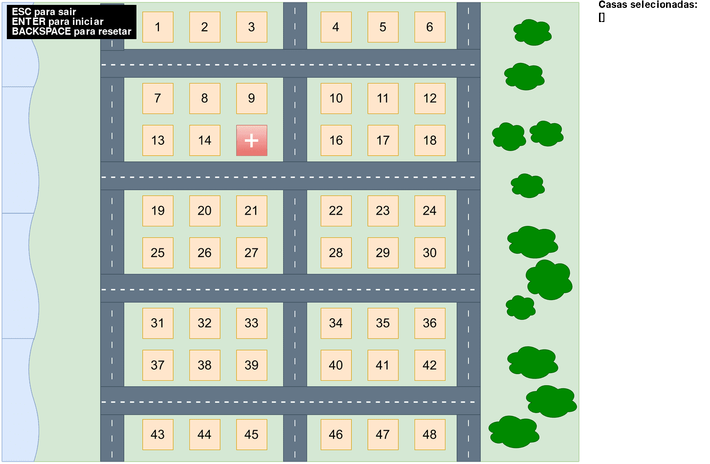
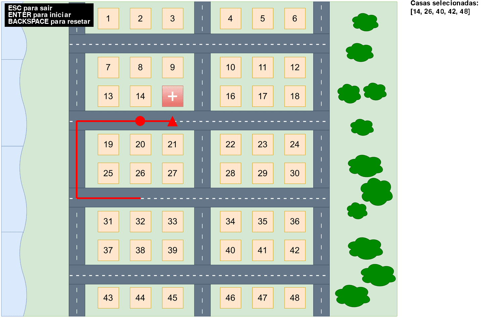
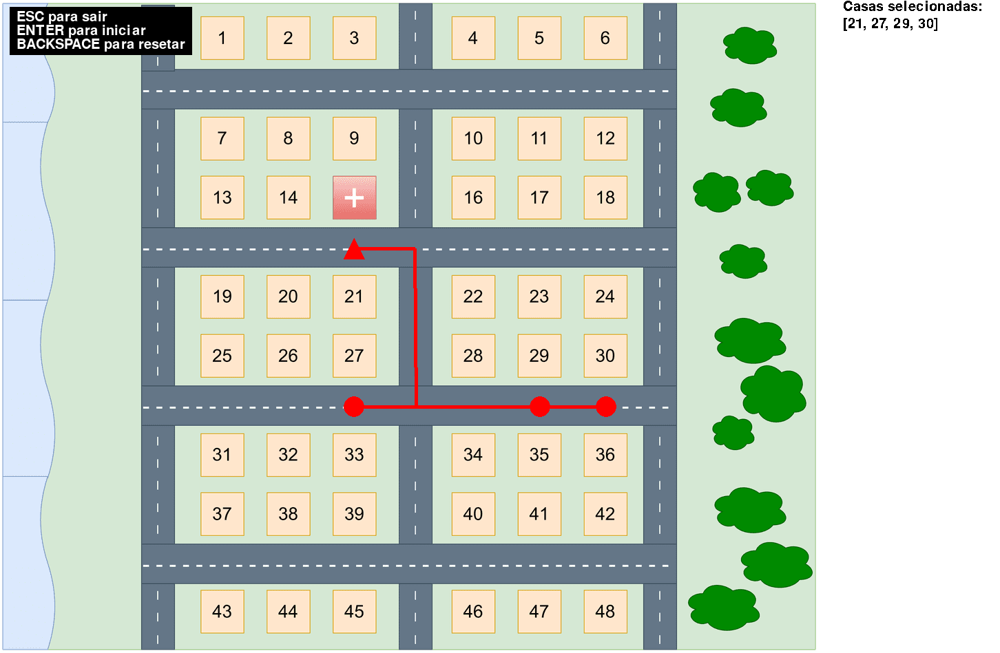

# Entrega otimizada

**Número da Lista**: 2<br>
**Conteúdo da Disciplina**: Grafos 2<br>

## Alunos
| Matrícula | Aluno                        |
| --------- | ---------------------------- |
| 211039250 | Arthur Grandão de Mello      |
| 211029540 | Pedro Sena Barbosa Holtz Yen |

## Sobre 

**Ideia proposta**

Dentro de um contexto de uma farmácia que precisa entregar uma quantidade variável de medicamentos dentro de um mapa, que seria a área de entrega da farmácia. O objetivo desse algoritmo é otimizar a entrega dos medicamentos, ou seja, entregando os medicamentos a partir da farmácia e voltando percorrendo a menor distância possível.


## Screenshots

### Etapa de seleção de casas



### Jogo em funcionamento



### Jogo finalizado




## Instalação 
**Linguagem**: Python (visualização e cálculo)<br>
**Framework**: Pygame <br>

## Uso 

1. Instale o python:

[Python 3.11](https://www.python.org/downloads/release/python-3119/)

2. Instale o pygame:

```bash
pip install pygame==2.6.0
```

3. Execute o projeto
```bash
cd src
python main.py
```

## Outros 

Clique nas casas para selecioná-las.


